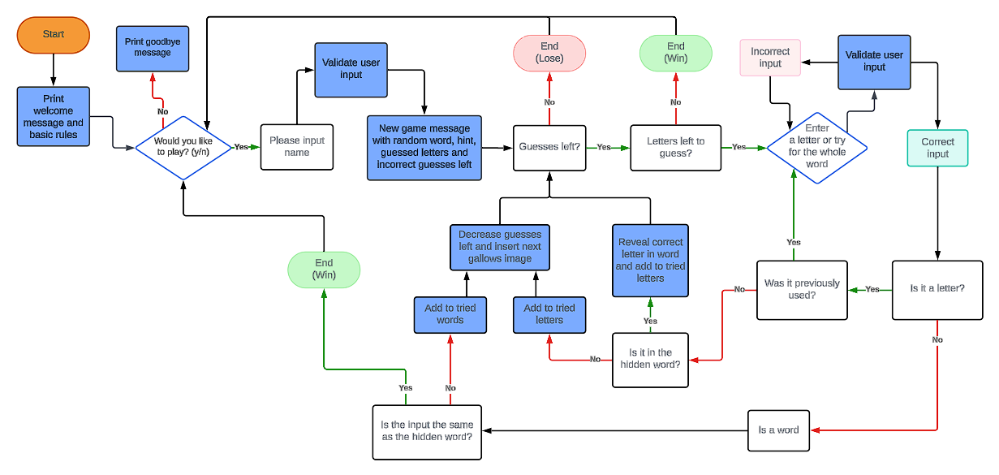
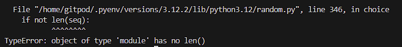
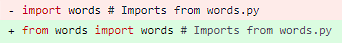
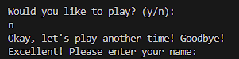

# Hangman
(by Robyn Soar)

Hangman is a word game and runs in the Code Institute mock terminal on Heroku.
It's a well-known childhood word game in which traditionally is played with two or more players, with one person choosing a word and setting up the game, and the other being the one to guess the letters one by one or the whole word at a time. Hangman has been made so the user can play against a computer who decides on a random word, keeps tally of used letters and guesses left available, as well as gives hints to the user or the hidden word. View the live site [here]

## Key Project Goals

- To give a fun game experience to the user that they can keep coming back to.
- To allow users to play as a singlular person instead of needed another to set up the game.

## Target Audience

- The primary target audience for Hangman is 5+, whether as a learning platform to help the younger audience learn how to spell or to soliditfy learning, but also for all reading ages to be able to have fun with a game.

## Table of Contents

- [Features](#features)
    - [Existing Features](#existing-features)
    - [Features Left to Implement](#features-left-to-implement)
- [Design](#design)
    - [Flowchart](#flowchart)
    - [Technologies Used](#technologoies-used)
- [Testing](#testing)
    - [Functional Testing](#functional-testing)
    - [Validator Testing](#validator-testing)
    - [Fixed Bugs](#fixed-bugs)
- [Deployment](#deployment)
    - [Version Control](#version-control)
    - [Deployment to Heroku](#deployment-to-heroku)
    - [Clone the Repository Code Locally](#clone-the-repository-code-locally)
- [Credits](#credits)
    - [Ackowledgements](#ackowledgements)
- [Author](#author)

## Features

### Existing Features

### Features Left to Implement

[Return to Table of Contents](#table-of-contents)

## Design

### Flowchart

[Lucidchart](https://www.lucidchart.com/pages/) was used to create a flowchart to map out the Hangman game.

This aids the creation of the game by showing validators for user input, where functions are needed as well as game end points.



### Technologies Used

- GitHub
    - Source code is hosted on GitHub.

- Git
    - Used for development of the game as well as commit and pushing code throughout.

- [pyfiglet (PyPi)](https://pypi.org/project/pyfiglet/)
    - Used to generate the ASCII art for the game title.

- [colorama](https://pypi.org/project/colorama/)
    - Used to colour ASCII art and text within the game.

- [Lucidchart](https://www.lucidchart.com/pages/)
    - Used to create a flowchart to map out the functions, validators and user input within the game.

[Return to Table of Contents](#table-of-contents)

## Testing

### Functional Testing

### Validator Testing

### Fixed Bugs

__Random Module Bug__

*Bug*

Terminal posed the below message to notify of an issue.



*Fix*

I noticed that the import wasn't being seen, and I needed to tweak it for the random module to see the necessary information.



__Boolean Game Stop Bug__

*Bug*

Main function would still execute after the User declined ('n') to play again.



*Fix*

Added an ```if``` statement to the main function to only excute if ```play_question() = True```

[Return to Table of Contents](#table-of-contents)

## Deployment

### Version Control

The site was created using the Git editor and pushed to GitHUb to the remote repository 'hangman'

The following git commands were used throughout development to push code to the remote repository:

```git add <file>``` - This command was used to add the file(s) to the staging area before they are commited.

```git commit -m "commit message"``` - This command was used to commit changes to the local repository queue ready to be pushed.

```git push``` - This command was used to push all committed code to the remote repository 'woohoo-salon' on GitHub.

### Deployment to Heroku

### Clone the Repository Code Locally

Navigate to the GitHub Repository you want to clone to use locally:
1. Click on the code drop down button
2. Click on HTTPS
3. Copy the repository link to the clipboard
4. Open your IDE of choice (Git must be installed for the next steps)
5. Type git close copied-git-url into the IDE terminal

The project will now of been cloned on your local machine for use.

[Return to Table of Contents](#table-of-contents)

## Credits

### Walkthrough Code

- [Coding Professor - How to create ASCII art text in Python](https://www.youtube.com/watch?v=Y0QiBbI3MWs)
    - YouTube video helped me understand how to import and style ASCII art fonts for the Hangman title.

### Acknowledgements

[Return to Table of Contents](#table-of-contents)

## Author

Robyn Soar
robyn999@hotmail.co.uk