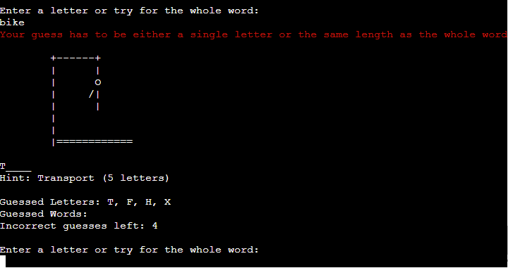
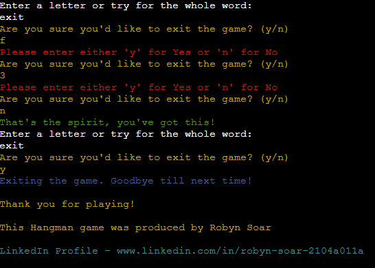

# Hangman
(by Robyn Soar)

Hangman is a word game and runs in the Code Institute mock terminal on Heroku.
It's a well-known childhood word game in which traditionally is played with two or more players, with one person choosing a word and setting up the game, and the other being the one to guess the letters one by one or the whole word at a time. 

This Hangman game has been made so the user can play against a computer who decides on a random word, keeps tally of used letters and guesses left available, as well as gives hints to the user of the hidden word. 

As this terminal-based Python project is design specifically for laptop / desktop screens, it will not display correctly on a mobile.

View the live site [here](https://robyn-hangman-b1356368c517.herokuapp.com/)

## Key Project Goals

- To give a fun game experience to the user that they can keep coming back to.
- To allow users to play as a singlular person instead of needed another to set up the game.

## Target Audience

- The primary target audience for Hangman is 5+, whether as a learning platform to help the younger audience learn how to spell or to soliditfy learning, but also for all reading ages to be able to have fun with a game.

## Table of Contents

- [Features](#features)
    - [Existing Features](#existing-features)
    - [Features Left to Implement](#features-left-to-implement)
- [Design](#design)
    - [Flowchart](#flowchart)
    - [Text Colours](#text-colours)
    - [Terminal Sizing](#terminal-sizing)
    - [Imported Libraries](#imported-libraries)
    - [Technologies Used](#technologoies-used)
- [Testing](#testing)
    - [Functional Testing](#functional-testing)
    - [Validator Testing](#validator-testing)
    - [Fixed Bugs](#fixed-bugs)
- [Deployment](#deployment)
    - [Version Control](#version-control)
    - [Deployment to Heroku](#deployment-to-heroku)
    - [Clone the Repository Code Locally](#clone-the-repository-code-locally)
- [Credits](#credits)
    - [Inspired Code](#inspired-code)
    - [Walkthrough Code](#walkthrough-code)
    - [Acknowledgements](#acknowledgements)
- [Author](#author)

## Features

### Existing Features

__Title Screen__

Hangmans ASCII art title was made with pyfiglet and colorama modules.

- Displays a clear title and introduction to the game.
- Provides the user with clear basic instruction and information.
- Asks the user if they would like to play the game.


__Play Game Validators__

After the basic rules, the user is asked if they'd like to play, the user is notified that they have to answer with either a "y" for yes, or "n" for no.
This appears if the user inputs something other than "y" or "n" but also if the user inputs a number or special character, as the game has explicitly notified the player what inputs are required.


The function also allows uppercase and lowercase inputs of "y" and "n" as seen below.


If the user answers with "n", the game will end with thanks to the player and credits to the myself as the developer with a link to my LinkedIn.


This can also be found at the end of the game when the user wins or losses and is asked if they'd like to play again.


__User Name and Validators__

After accepting (Pressing the "y" key) to play the game, the user is then asked to provide their name. This will then be called throughout the game for greetings, goodbyes, game wins and game losses.

The function has validators to make sure the user is inputting the correct data. As seen below:

- User cannot enter nothing
- Entered at least two characters
- Characters cannot contain numbers or special characters, even with an input with enough characters
- Returns the username capitalised to be used throughout.


__Beginning of gameplay__

After the user inputs their name, the game welcomes them and reiterates how many wrong guesses they've got before it's Game Over.

It also shows the game main layout with a structure that's repeated after each guess of a word or letter till the game is over, this includes:

- The gallows, which gives the user a visual representation of how many incorrect guesses they've got left till Game Over.
- The word, chosen at random, and hidden from the player.
- The hint corresponding to the word generated along with how many letters it contains. This is because the "_" used to hide the letters as placeholders can make it hard to see how many letters there are, and allow the user to guess without counting the underscores.
- Guessed letters as an empty list, which will gather the letters the user has previously guessed, whether correct or incorrect.
- Guessed words as an empty list, which will gather the words the user has previously guessed incorrectly.
- The amount of incorrect guesses the user has left before Game Over as a written representation to the user, incase the visual image of the gallows isn't clear to the user.
- Prompts the user for their guess, either a single letter or for the whole word.

The words and hints used for each Hangman game are randomly generated from a words.py file that is separate from the run.py file and imported in.


__Game Input Validators__

Within the letter or word prompt from the game, validators make sure that the user is entering a correct input.

Invalid inputs do not take down the guesses left and they also do not accept numbers or special characters including empty inputs.


Correct inputs are either a single letter or a guess that is the same length of the hidden word



__Correct Guess__

A correct guess of a letter within the hidden word will give feedback to the user by reiterating that the letter they input is in the word in green.

The game will show the updated main necessary information to the user.

- The correct letter is input into the word in it's correct placement.
- The guessed letters list now stores the letter recently guessed by the user.
- The incorrect guessed left has not changed as this was correct.

The game then prompts the user for another letter or whole word.


__Incorrect Guess__

An incorrect guess of a letter or word within will give feedback to the user by reiterating that the input letter or word is either not within the word or not the whole word, and display this in red.

The game will show the updated main necessary information to the user.

- The gallows art has updated to show the slow addition of a person with each incorrect guess.
- The incorrect letters guessed are stored within the guessed letters list.
- The incorrect words guessed are stores within the guessed words list.
- The incorrect guesses left has depleted by 1 each wrong answer for either wrong letter or wrong word guessed.

The game then prompts the user for another letter or whole word.


__The Gallows__

The gallows visual representation is made with ASCII art and stored within a file separate from the run.py, called hangman.py, which is then imported in.

For each incorrect guess by the user, the gallows art updates in stages as seen below:


__Game - Win__

If the user is able to guess all the letters in the word or the whole word at once, the game reiterates the word to the user with green text. Showing again the game main setup, the full word now filled in, as well as the previous information shown. Showing the current stage of the gallows, letters and words guessed, and how many tries the user had left.

In green text the game then congratulates the user and thanking the user with their input username, and asks if they would like to play another game.

This loops back to the start of the game under the title screen, if the player inputs "y" a fresh game will begin with a new hidden word and hint, refreshing the users guesses left, emptying the letter and word lists and resetting the gallows.

If the user answers "n" they are taken to the ending credits as seen above.


__Game - Lose__

If the user is unable to guess the whole word before the gallows is full and the guesses they have left has depleted to 0, the game consoles the user and letting them know they had no more guesses and the game is over in red text.

The hidden word is then revealed to the player in yellow text.

The game then thanks the user for playing and asks if they'd like to play again in green text.

This loops back to the start of the game under the title screen, if the player inputs "y" a fresh game will begin with a new hidden word and hint, refreshing the users guesses left, emptying the letter and word lists and resetting the gallows.

If the user answers "n" they are taken to the ending credits as seen above.


__Exiting the game__

The main game function allows the user to input "exit" instead of a letter or word. They are then asked by the program if they're sure they'd like to exit, which the user can input either a "y" for yes or a "n" for no.

Validators ensure the user can enter either a "y" or a "no" and no words, numbers or special characters.

If the user inputs "y" to exit the game the end credits and LinkedIn profile link is shown to the user.



If the user changes their mind and doesn't want to exit and presses "n", the game will continue from where it left off without restarting as seen below.


### Features Left to Implement

- A difficulty system that the user will be able to choose for themself.
This would be something that would keep words fairly easy as they are currently as the first level, to more complex words, another difficulty on top of that and the last difficulty to include all words from the English dictionary at random.

- A scoreboard for all players of the Hangman game that has a leaderboard of the users that were able to guess the words with the fewest incorrect guesses.

[Return to Table of Contents](#table-of-contents)

## Design

### Flowchart

[Lucidchart](https://www.lucidchart.com/pages/) was used to create a flowchart to map out the Hangman game.

This aids the creation of the game by showing validators for user input, where functions are needed as well as game end points.


### Text colours

Colorama was imported to use coloured font within the terminal.

White
    - For basic rules at the beginning and anything within the gameplay.

Cyan
    - For the greeting message, presents as an excited colour hue.

Blue
    - For the goodbye message, presents as a more sullen hue.

Yellow
    - For any important information such as exiting the game and reiteration.

Red
    - For any messages such as incorrect inputs, wrong guesses or losing the game.

Green
    - For any correct guesses and winning the game.

### Terminal Sizing

The Hangman game was designed in Python for a terminal 80 characters wide and 24 lines high.

The game was designed to display correctly within the 80 character limit.

### Imported Libraries

__pyfiglet (PyPi)__ - Used to generate ASCII art text for the title

__colorama__ - Used to colour ASCII art and text feedback to the user

__sys__ - Used to enable the user to be able to exit the program at any time

__random__ - Used to allow the program to randomly choose a word from a dictionary within the words.py file

### Technologies Used

- GitHub
    - Source code is hosted on GitHub.

- Git
    - Used for development of the game as well as commit and pushing code throughout.

- [pyfiglet (PyPi)](https://pypi.org/project/pyfiglet/)
    - Used to generate the ASCII art for the game title.

- [colorama](https://pypi.org/project/colorama/)
    - Used to colour ASCII art and text within the game.

- [Lucidchart](https://www.lucidchart.com/pages/)
    - Used to create a flowchart to map out the functions, validators and user input within the game.

[Return to Table of Contents](#table-of-contents)

## Testing

### Functional Testing

Testing was performed throughout construction of the Hangman game's code for all validators of user input and the results given by the program.

__"Would you like to play? (y/n)"__

Program asks the user if they would like to play and prompts them to input either (y/n).

_- Scenario One_

User inputs nothing / numbers / letters that aren't "y" or "n".

Expected: 

Program responds in red text "Please enter either 'y' for Yes or 'n' for No"

Actual:

As expected.

_- Scenario Two_

User inputs lowercase or uppercase "y".

Expected: 

Program responds with "Excellent! Please enter your name:", and prompts user to enter their name.

Actual:

As expected.

_- Scenario Three_

User enters lowercase or uppercase "n".

Expected:

Program prints the following credits of the developer:
    - "Okay, let's play another time"
    - "Thank you for playing!"
    - "This Hangman game was produced by Robyn Soar"
    - "LinkedIn Profile - www.linkedin.com/in/robyn-soar-2104a011a"

The play_game function loop then calls ```break```.

Actual:

As expected.

__"Excellent! Please enter your name:"__

Program prompt user to input users name.

_- Scenario One_

User inputs less than 2 characters. This could be an number, special charater or singlular letter.

Expected:

Program prints in red text to user "Please enter a name of at least two letters! Try again."

Actual:

As expected.

_- Scenario Two_

User inputs at least two characters but it contains either a number or special character.

Expected:

Program prints in red text to user "Your name should contain only alphabetical characters, try again."

Actual:

As expected.

_- Scenario Three_

User inputs using only alphabetical letters and at least two.

Expected:

Program prints in cyan text to user "Hello {username}! Nice to meet you, let's play!" with the username the user input as a capitalised word and starts the game play.

    - Randomly generates a word and corresponding hint from the words.py dictionary
    - Displays the current stage of the gallows
    - Hides the letters of the hidden word with underscores
    - Displays the corresponding hint for the word
    - Displays the guessed letters list
    - Displays the guessed words list
    - Displays the incorrect guesses left

Actual:

As expected.

__"Enter a letter or try for the whole word:"__

Program prompts the user to "Enter a letter or try for the whole word".

_- Scenario One_

User enters a number or special character.

Expected:

Program prints to the user in red text "Please try again with no numbers or special characters."

Actual:

As expected.

_- Scenario Two_

User enters more than a single letter but not the same length as the hidden word.

Expected:

Program prints to the user in red text "Your guess has to be either a single letter or the same length as the whole word".

Actual:

As expected.

_- Scenario Three_

User enters a single letter *not* in the hidden word.

Expected:

Program prints:
    - "The letter {guess} isn't in the word"
    - Displays the gallow stage corresponding to the amount of tries left
    - Updates guessed letters list
    - Updates incorrect guesses left

Prompts user to enter a letter or try for the whole word.

Actual:

As expected.

_- Scenario Four_

User enters a word that is *not* the hidden word.

Expected:

Program prints:
    - "{guess} is not the word"
    - Displays the gallow stage corresponding to the amount of tries left
    - Updates guessed words list
    - Updates incorrect guesses left

Prompts user to enter a letter or try for the whole word.

Actual:

As expected

_- Scenario Five_

User enters a single letter in the hidden word.

Expected:

Program prints:
    - "Yes! {guess} is in the word"
    - Updates the hidden word with the correct letter guessed in the correct position
    - Updates guessed letters list

Prompts user to enter a letter or try for the whole word.

Actual:

As expected

_- Scenario Six_

User enters the last single letter required in the hidden word.

Expected:

Program prints:
    - "Yes! {guess} is in the word"
    - Updates the hidden word with the correct letter guessed in the correct position
    - Updates guessed letters list
    - "Congratulations {username}! You got it, the word was {word}!"
    - "Thanks for playing Hangman {username}, another game maybe?

Loops back to the start of the play_game function and asks the user if they'd like to play again and prompts for an input.

Actual:

As expected

_- Scenario Seven_

User enters a word that is the hidden word.

Expected:

Program prints:
    - "YOU GOT IT! The word was {word}!"
    - Updates the hidden word with the correct letters in the correct position
    - "Congratulations {username}! You got it, the word was {word}!"
    - "Thanks for playing Hangman {username}, another game maybe?

Loops back to the start of the play_game function and asks the user if they'd like to play again and prompts for an input.

Actual:

As expected

_- Scenario Eight_

User guesses incorrectly 7 times causing Game Over.

Expected:

Program prints:
    - "Sorry {username}, you've run out of guesses and it's Game Over!"
    - "The word was {word}"
    - "Thanks for playing Hangman {username}, another game maybe?

Loops back to the start of the play_game function and asks the user if they'd like to play again and prompts for an input.

Actual:

As expected

__"Are you sure you'd like to exit the game? (y/n)"__

Within the program asking the user to enter a letter or try for the whole word, the user inputs "exit". Program asks the user if they are sure they'd like to exit the game and prompts them to input either (y/n).

_- Scenario One_

User inputs nothing / numbers / letters that aren't "y" or "n".

Expected: 

Program responds in red text "Please enter either 'y' for Yes or 'n' for No"

Actual:

As expected.

_- Scenario Two_

User inputs lowercase or uppercase "y".

Expected: 

Program responds with:

    - "Exiting the game. Goodbye till next time!"

Program then responds with the same goodbye credits as if the user had declined to play again.

    - "Thank you for playing"
    - "This Hangman game was produced by Robyn Soar"
    - "LinkedIn Profile - www.linkedin.com/in/robyn-soar-2104a011a"

Program then uses ```sys.exit()``` to exit the loop.

Actual:

As expected.

_- Scenario Three_

User enters lowercase or uppercase "n".

Expected:

Program prints:

    - "That's the spirit, you've got this!"

Program then asks the user to "Enter a letter or try for the whole word"

Actual:

As expected.

### Validator Testing

The Hangman game code is written is Python only, passing it through the [CI Python Linter - Pep8 Validator](https://pep8ci.herokuapp.com/)

No errors were found when passing the run.py file through the CI Python Linter.


### Fixed Bugs

__Random Module Bug__

*Bug*

Terminal posed the below message to notify of an issue.


*Fix*

I noticed that the import wasn't being seen, and I needed to tweak it for the random module to see the necessary information.


__Boolean Game Stop Bug__

*Bug*

Main function would still execute after the User declined ('n') to play again.


*Fix*

Added an ```if``` statement to the main function to only excute if ```play_question() = True```

__Extra Space Bug__

*Bug*

Within the code ```word_completion = "_" * len(word)```, the "_" had been changed to have a space ("_ ") with the intention to give better readability to the user when the word was hidden.

In the terminal this showed as intended, however, the hidden word took on the spaces as a hidden letter, and showed ```_ _ _ ``` instead of ```______``` for a 6 letter word.

The program was also ending after 4-5 correct guesses, even with enough 'tries' left.

*Fix*

Simply reseting "_ " back to "_" fixed the part of the bug that limited the amount of tries given with correct guesses.

Inside the words.py file dictionary, the amount of letters was also put into the hint given for each word, which accounts for the lack of visible spaces between hidden letters.

[Return to Table of Contents](#table-of-contents)

## Deployment

### Version Control

The site was created using the Git editor and pushed to GitHUb to the remote repository 'hangman'

The following git commands were used throughout development to push code to the remote repository:

```git add <file>``` - This command was used to add the file(s) to the staging area before they are commited.

```git commit -m "commit message"``` - This command was used to commit changes to the local repository queue ready to be pushed.

```git push``` - This command was used to push all committed code to the remote repository 'woohoo-salon' on GitHub.

### Deployment to Heroku

1. Make sure that Heroku will install dependencies used by opening the "requirements.txt" file and typing "pip3 freeze > requirements.txt" and hit the "Enter" key.
2. Commit and push the changes to GitHub.
3. Go to Heroku.com and sign up for an account.
4. Click "Create new app".
5. Give the app a unique name, select region and "Create app".
6. Go to "Settings" and then to "Config Vars".
7. Create a Config Var called PORT (Key) and set it to 8000 (Value).
8. Scroll down, click "Add buildpack" and add two buildpacks within the "Settings" tab, and add them in the following order.
    * heroku/python
    * heroku/nodejs
9. Click "Deploy" in the navbar at the top of the page.
10. Select "GitHub" within the section called "Deployment method".
11. Click "Connect to GitHub".
12. Under "Connect to GitHub, search for your repository name and click "Connect".
13. Scroll down the page to Automatic deploys and click "Enable Automatic Deploys" to enable Heroku to rebuild the app when a new change is pushed to GitHub.
14. When deployment is completed and you're notified that the deployment was successful, click "View" to go to the mock terminal.

### Clone the Repository Code Locally

Navigate to the GitHub Repository you want to clone to use locally:
1. Click on the code drop down button
2. Click on HTTPS
3. Copy the repository link to the clipboard
4. Open your IDE of choice (Git must be installed for the next steps)
5. Type git close copied-git-url into the IDE terminal

The project will now of been cloned on your local machine for use.

[Return to Table of Contents](#table-of-contents)

## Credits

### Inspired Code

- [Love Sandwiches - Code Institute](https://learn.codeinstitute.net/courses/course-v1:CodeInstitute+LS101+1/courseware/293ee9d8ff3542d3b877137ed81b9a5b/58d3e90f9a2043908c62f31e51c15deb/)
    - Used for sections of basic code.

- [How to Build HANGMAN with Python in 10 MINUTES - Kite](https://www.youtube.com/watch?v=m4nEnsavl6w)
    - Used as guidance on how to excute certain parts of code.

- [Write a long string on multiple line in Python - note.nkmk.me](https://note.nkmk.me/en/python-long-string/)
    - Used to format code to fit within 80 characters on a single line by using newline characters and parenthesis.

### Walkthrough Code

- [Coding Professor - How to create ASCII art text in Python](https://www.youtube.com/watch?v=Y0QiBbI3MWs)
    - YouTube video helped me understand how to import and style ASCII art fonts for the Hangman title.

### Acknowledgements

[Return to Table of Contents](#table-of-contents)

## Author

Robyn Soar
robyn999@hotmail.co.uk